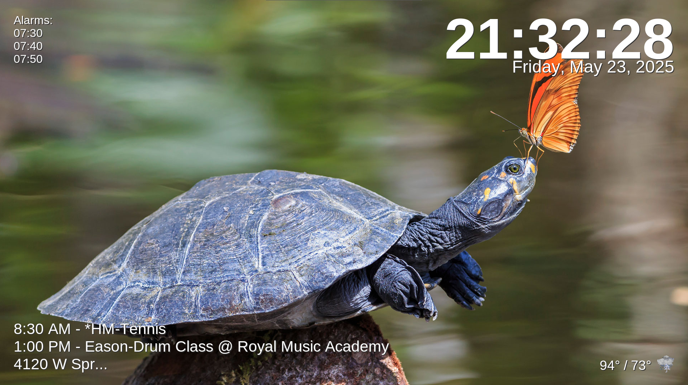

# Thyme 🌿⏰

[](https://python.org)
[](LICENSE)
[](https://github.com/your-username/thyme/graphs/commit-activity)
[](https://www.buymeacoffee.com/lielu)

A beautiful, full-screen digital clock application with Google Calendar integration, alarms, weather display, and dynamic backgrounds. Perfect for Raspberry Pi kiosks, wall-mounted displays, or any always-on screen.



## ✨ Features

- **🕐 Full-screen Digital Clock**: Large, readable time and date display
- **📅 Google Calendar Integration**: Shows your upcoming events with smart formatting
- **⏰ Configurable Alarms**: Visual and audio notifications with TTS announcements
- **🌤️ Weather Display**: Current weather conditions with beautiful icons
- **💬 Discord Integration**: Shows recent messages from Discord channels
- **🖼️ Dynamic Backgrounds**: Rotating images with smooth fade transitions
- **🎵 Text-to-Speech**: Announces events when alarms trigger
- **💻 Cross-Platform**: Works on Windows, macOS, and Linux
- **🔧 Highly Configurable**: Environment variables and config files
- **🔊 Smart Audio**: Platform-specific audio handling
- **📱 Kiosk Mode**: Hide cursor, fullscreen, auto power management

## 🚀 Quick Start

1. **Start Thyme:** Run the shell script:
```bash
./start_thyme.sh
```

2. **Open settings:** Press `F6` or click the ⚙️ icon to configure your display

The application will start in windowed mode by default. For full-screen kiosk mode, set `SCREEN_FULLSCREEN=True` in your environment or `alarm_config.txt`.

## 🛠️ Configuration

### Settings Page (Recommended)

Access the graphical settings page in two ways:
- **Click the gear icon** in the top-right corner of the display
- Press **F6** while Thyme is running

This provides an easy way to configure:

- **Calendar Settings**: Google Calendar ID
- **Discord Integration**: Bot token and channel ID  
- **Weather Settings**: Location (latitude/longitude), timezone, temperature units
- **Alarms**: Add, edit, and delete alarm times with a user-friendly interface
- **Display Management**: Automatic screen on/off times

The settings page includes helpful tooltips, validation, and the ability to automatically detect your current location for weather settings.

### Configuration File (alarm_config.txt)

All settings are stored in `src/alarm_config.txt` for easy manual editing and version control:

```bash
# Thyme Configuration
# This file contains all settings for the Thyme application

# Google Calendar Settings
CALENDAR_ID=your-email@gmail.com

# Weather Settings
LATITUDE=32.7767
LONGITUDE=-96.7970
TIMEZONE=America/Chicago
TEMP_UNIT=fahrenheit

# Discord Integration Settings
DISCORD_TOKEN=your_bot_token_here
DISCORD_CHANNEL_ID=your_channel_id_here

# Display Power Management
DISPLAY_OFF=23:00
DISPLAY_ON=07:00

# Alarm Times (HH:MM format, 24-hour)
07:00
07:30
12:00
18:00
```

### Environment Variables (Alternative)

You can also configure the application using environment variables, which will override settings in `src/alarm_config.txt`:

```bash
# Calendar settings
export KIOSK_CALENDAR_ID="your-email@gmail.com"

# Weather location (Dallas, TX by default)
export KIOSK_LATITUDE="32.7767"
export KIOSK_LONGITUDE="-96.7970"
export KIOSK_TIMEZONE="America/Chicago"
export KIOSK_TEMP_UNIT="fahrenheit"  # or "celsius"

# Discord integration (optional)
export KIOSK_DISCORD_TOKEN="your_bot_token_here"
export KIOSK_DISCORD_CHANNEL_ID="your_channel_id_here"
```

### Legacy Configuration

For backwards compatibility, the application also reads from:
- Environment variables (takes precedence)
- Old `alarm_config.txt` format (alarms and display times only)
- `.env` files (if present)

### Background Images

Place background images in the `src/backgrounds/` directory:
- Supported formats: JPG, PNG, GIF, BMP
- Images are automatically resized to screen resolution
- Rotates every 30 seconds with fade effects

## Project Structure

The project is organized into the following structure:

```
├── src/                         # Source code
│   ├── alarm_config.txt         # Configuration file
│   ├── credentials.json         # Google Calendar API credentials
│   ├── discord_token.txt        # Discord bot token (optional)
│   ├── kiosk_clock_app.py       # Main application entry point
│   ├── config.py                # Configuration management
│   ├── settings_manager.py      # Settings interface and management
│   ├── alarm_manager.py         # Alarm functionality
│   ├── audio_manager.py         # Audio playback and TTS
│   ├── calendar_integration.py  # Google Calendar integration
│   ├── weather_manager.py       # Weather data and icons
│   ├── background_manager.py    # Dynamic backgrounds
│   ├── discord_manager.py       # Discord integration
│   ├── utils.py                 # Utility functions
│   ├── backgrounds/             # Background images
│   ├── sounds/                  # Audio files
│   │   └── alarm.wav            # Default alarm sound
│   ├── weather_icons/           # Weather icon files
│   └── test/                    # Test files
│       ├── test_embedded_settings.py
│       ├── test_settings_icon.py
│       ├── test_config_reading.py
│       ├── test_discord.py
│       └── test_*.py            # Other test files
├── run_thyme.py                 # Application launcher
├── start_thyme.sh               # Shell script launcher
├── requirements.txt             # Python dependencies
├── logs/                        # Application logs
└── docs/                        # Documentation
```

## 🖥️ Platform-Specific Setup

### Raspberry Pi

1. **Install audio dependencies**
   ```bash
   sudo apt-get update
   sudo apt-get install aplay mpg123 espeak
   ```

2. **Install emoji fonts** (for Discord emoji display)
   ```bash
   sudo apt install fonts-noto-color-emoji
   ```
   *This enables proper display of emojis in Discord messages. After installation, restart the application.*

3. **Auto-start on boot** (create systemd service)
   ```bash
   sudo cp thyme.service /etc/systemd/system/
   sudo systemctl enable thyme.service
   sudo systemctl start thyme.service
   ```

4. **Configure audio output**
   ```bash
   sudo raspi-config
   # Navigate to System Options > Audio > Select HDMI/Headphones
   ```

### Linux Desktop

```bash
# Ubuntu/Debian
sudo apt-get install mpg123 espeak-ng

# Fedora/CentOS
sudo dnf install mpg123 espeak-ng

# Arch Linux
sudo pacman -S mpg123 espeak-ng
```

### macOS

```bash
# Using Homebrew
brew install mpg123
# Note: TTS uses built-in macOS speech synthesis
```

### Windows

No additional setup required - uses built-in Windows audio systems.

## 🎨 Customization

### Weather Icons

Weather icons are located in `src/weather_icons/` and use Open-Meteo weather codes:
- `clear.png` - Clear skies
- `partly_cloudy.png` - Partly cloudy
- `cloudy.png` - Overcast
- `rain.png` - Rain/drizzle
- `snow.png` - Snow
- `thunderstorm.png` - Thunderstorms
- `fog.png` - Fog

### Fonts and Layout

Modify `config.py` to customize:
- Font families, sizes, and styles
- UI margins and positioning
- Colors and visual effects
- Update intervals

### Background Sources

The application includes a script to download Bing daily wallpapers:
```bash
./download_bing_wallpaper.sh
```

## 🔧 Development

### Running in Development Mode

```bash
# Non-fullscreen mode for development
python3 run_thyme.py
# Press ESC to exit
# Press F5 to reload configuration
# Press F6 to open settings page
# Or click the gear icon in the top-right corner
```

### Code Structure

The application uses a modular architecture:

- **Config Management**: Centralized configuration with environment variable support
- **Manager Classes**: Separate managers for different concerns (audio, weather, etc.)
- **Error Handling**: Comprehensive logging and graceful error recovery
- **Type Hints**: Full type annotations for better code quality

### Adding Features

1. Create a new manager class in its own module
2. Add configuration options to `config.py`
3. Integrate with main application in `kiosk_clock_app.py`
4. Add tests and documentation

## 📊 Logging

Logs are written to `logs/thyme_YYYYMMDD.log` with rotation:
- **DEBUG**: Detailed operational information
- **INFO**: General application flow
- **WARNING**: Potential issues
- **ERROR**: Serious problems that don't crash the app

## 🚨 Troubleshooting

### Common Issues

**Google Calendar not working**
- Verify `src/credentials.json` is present and valid
- Check calendar permissions in Google Cloud Console
- Ensure internet connectivity

**Audio not playing**
- Linux: Install `aplay` and `mpg123`
- Check audio device configuration
- Verify `src/sounds/alarm.wav` file exists

**Weather not updating**
- Check internet connectivity
- Verify latitude/longitude coordinates
- Review weather API rate limits

**Background images not showing**
- Place images in `src/backgrounds/` directory
- Check image file formats (JPG, PNG, GIF, BMP)
- Verify file permissions

**Settings window not opening on Raspberry Pi**
- Error: "grab failed: window not viewable" 
- This issue has been fixed with delayed modal setup
- Settings window will still work even if modal grab fails
- Use test script: `python3 test_settings_rpi.py` to verify

### Debug Mode

Enable debug logging:
```bash
export LOG_LEVEL=DEBUG
python3 run_thyme.py
```

## 🤝 Contributing

We welcome contributions! Please see our [Contributing Guide](CONTRIBUTING.md) for details.

### Quick Contribution Steps

1. Fork the repository
2. Create a feature branch (`git checkout -b feature/amazing-feature`)
3. Commit your changes (`git commit -m 'Add amazing feature'`)
4. Push to the branch (`git push origin feature/amazing-feature`)
5. Open a Pull Request

### Development Setup

```bash
# Clone your fork
git clone https://github.com/your-username/thyme.git
cd thyme

# Install development dependencies
pip install -r requirements-dev.txt

# Run tests
python -m pytest

# Run linting
flake8 .
black .
```

## 📜 License

This project is licensed under the MIT License - see the [LICENSE](LICENSE) file for details.

## 🙏 Acknowledgments

- **Open-Meteo API** for weather data
- **Google Calendar API** for calendar integration
- **gTTS (Google Text-to-Speech)** for voice announcements
- **Pillow** for image processing
- **Tkinter** for the GUI framework

## 🔗 Related Projects

- [Magic Mirror](https://magicmirror.builders/) - Smart mirror software
- [DAKboard](https://dakboard.com/) - Digital dashboard
- [Screenly OSE](https://www.screenly.io/ose/) - Digital signage

## 📞 Support

- 🐛 **Bug Reports**: [GitHub Issues](https://github.com/your-username/thyme/issues)
- 💡 **Feature Requests**: [GitHub Discussions](https://github.com/your-username/thyme/discussions)
- 📧 **Email**: your-email@example.com

## 🗺️ Roadmap

- [ ] **Web Interface**: Configuration via web browser
- [ ] **Multiple Calendars**: Support for multiple Google Calendar accounts
- [ ] **Plugins System**: Extensible plugin architecture
- [ ] **Mobile App**: Companion mobile app for remote control
- [ ] **Weather Radar**: Animated weather radar maps
- [ ] **Smart Home Integration**: HomeAssistant, MQTT support
- [ ] **Voice Control**: Wake word activation for voice commands
- [ ] **Themes**: Predefined visual themes and styles

## ☕ Support the Project

If you find this project helpful and would like to support its continued development, consider buying me a coffee! Your support helps keep this project maintained and enables new features.

[](https://www.buymeacoffee.com/lielu) 

Every contribution, no matter how small, is greatly appreciated and motivates me to keep improving this project for the community. Thank you! 🙏

---

Made with ❤️ for the open source community

