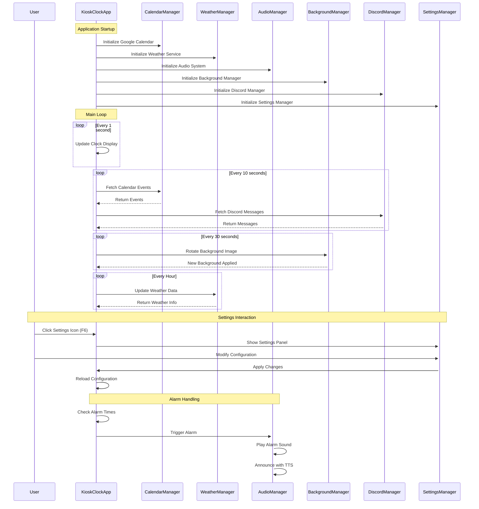
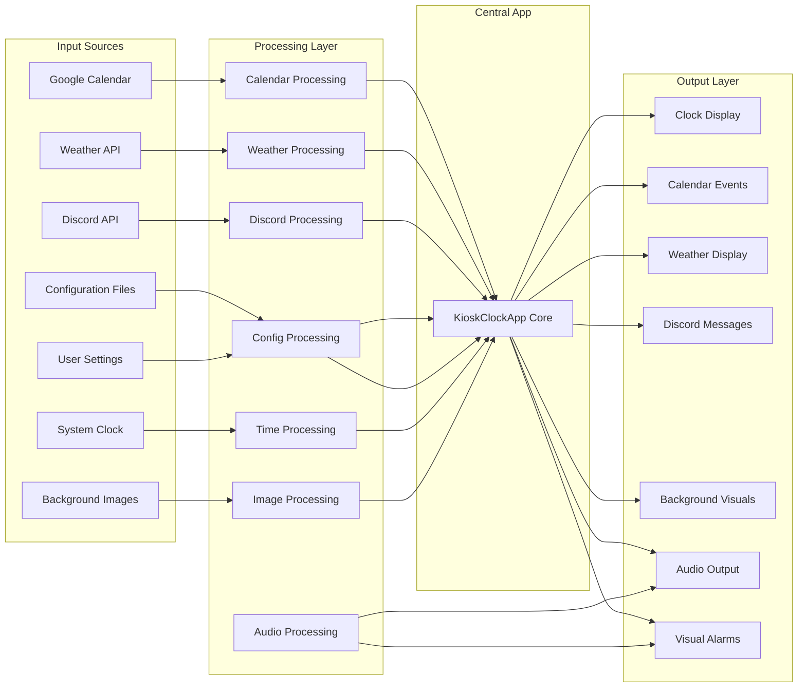
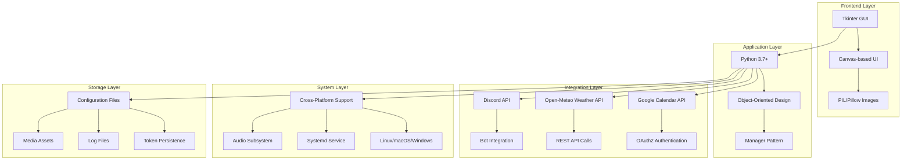
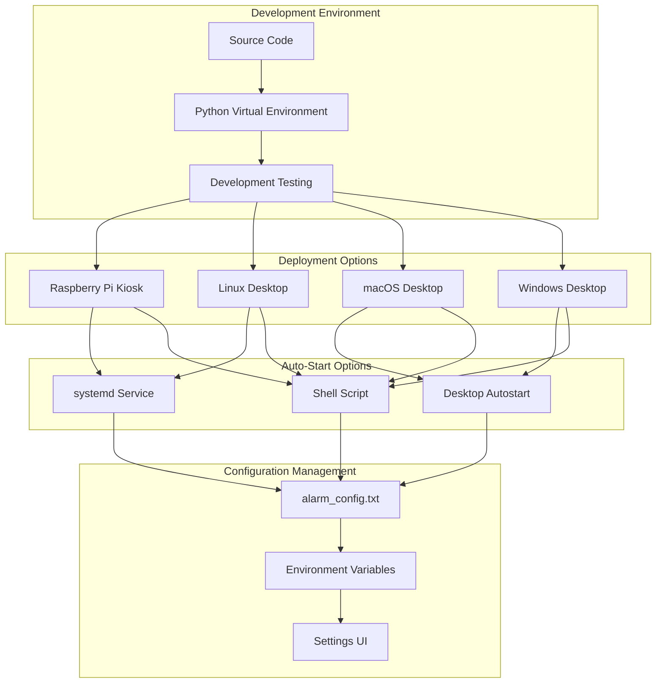

# Thyme Project Architecture

## System Architecture Diagram

```mermaid
graph TB
    %% Entry Points
    subgraph "Entry Points"
        A[start_thyme.sh] --> B[run_thyme.py]
        B --> C[kiosk_clock_app.py]
        D[thyme.service] --> C
    end

    %% Main Application
    subgraph "Main Application"
        C --> E[KioskClockApp Class]
    end

    %% Configuration Layer
    subgraph "Configuration Layer"
        F[config.py] --> G[UserConfig]
        H[alarm_config.txt] --> G
        I[Environment Variables] --> G
        G --> E
    end

    %% Core Managers
    subgraph "Core Manager Components"
        E --> J[CalendarManager]
        E --> K[AudioManager]
        E --> L[AlarmManager]
        E --> M[WeatherManager]
        E --> N[BackgroundManager]
        E --> O[DiscordManager]
        E --> P[SettingsManager]
    end

    %% External Services
    subgraph "External Services"
        Q[Google Calendar API] --> J
        R[Open-Meteo Weather API] --> M
        S[Discord API] --> O
    end

    %% File System Resources
    subgraph "File System Resources"
        T[backgrounds/] --> N
        U[sounds/] --> K
        V[weather_icons/] --> M
        W[credentials.json] --> J
        X[token.pickle] --> J
        Y[discord_token.txt] --> O
    end

    %% UI Components
    subgraph "UI Components"
        E --> Z[Main Canvas]
        Z --> AA[Clock Display]
        Z --> BB[Date Display]
        Z --> CC[Alarms Display]
        Z --> DD[Events Display]
        Z --> EE[Weather Display]
        Z --> FF[Discord Display]
        Z --> GG[Settings Icon]
        P --> HH[Settings Overlay]
    end

    %% Utilities
    subgraph "Utilities"
        II[utils.py] --> E
        JJ[Logging System] --> II
        KK[Screen Dimensions] --> II
        LL[Text Rendering] --> II
    end

    %% System Integration
    subgraph "System Integration"
        MM[Text-to-Speech] --> K
        NN[Audio Playback] --> K
        OO[Display Management] --> E
        PP[Auto-start Service] --> D
    end

    %% Data Flow Arrows
    J -.->|Calendar Events| DD
    L -.->|Alarm Status| CC
    M -.->|Weather Data| EE
    O -.->|Discord Messages| FF
    N -.->|Background Images| Z
    K -.->|Audio Feedback| MM
    K -.->|Audio Feedback| NN

    %% Configuration Flow
    P -.->|Settings Updates| G
    G -.->|Config Changes| E

    %% Style Classes
    classDef entry fill:#e1f5fe
    classDef main fill:#f3e5f5
    classDef manager fill:#e8f5e8
    classDef external fill:#fff3e0
    classDef ui fill:#fce4ec
    classDef config fill:#f1f8e9
    classDef resource fill:#f9f9f9

    class A,B,D entry
    class C,E main
    class J,K,L,M,N,O,P manager
    class Q,R,S external
    class Z,AA,BB,CC,DD,EE,FF,GG,HH ui
    class F,G,H,I config
    class T,U,V,W,X,Y resource
```

## Component Interaction Flow

```mermaid
sequenceDiagram
    participant U as User
    participant App as KioskClockApp
    participant CM as CalendarManager
    participant WM as WeatherManager
    participant AM as AudioManager
    participant BM as BackgroundManager
    participant DM as DiscordManager
    participant SM as SettingsManager

    Note over App: Application Startup
    App->>+CM: Initialize Google Calendar
    App->>+WM: Initialize Weather Service
    App->>+AM: Initialize Audio System
    App->>+BM: Initialize Background Manager
    App->>+DM: Initialize Discord Manager
    App->>+SM: Initialize Settings Manager

    Note over App: Main Loop
    loop Every 1 second
        App->>App: Update Clock Display
    end

    loop Every 10 seconds
        App->>CM: Fetch Calendar Events
        CM-->>App: Return Events
        App->>DM: Fetch Discord Messages
        DM-->>App: Return Messages
    end

    loop Every 30 seconds
        App->>BM: Rotate Background Image
        BM-->>App: New Background Applied
    end

    loop Every Hour
        App->>WM: Update Weather Data
        WM-->>App: Return Weather Info
    end

    Note over U,SM: Settings Interaction
    U->>App: Click Settings Icon (F6)
    App->>SM: Show Settings Panel
    U->>SM: Modify Configuration
    SM->>App: Apply Changes
    App->>App: Reload Configuration

    Note over App,AM: Alarm Handling
    App->>App: Check Alarm Times
    App->>AM: Trigger Alarm
    AM->>AM: Play Alarm Sound
    AM->>AM: Announce with TTS
```

## Data Flow Architecture

```mermaid
flowchart LR
    %% Input Sources
    subgraph "Input Sources"
        A1[Google Calendar]
        A2[Weather API]
        A3[Discord API]
        A4[Configuration Files]
        A5[User Settings]
        A6[System Clock]
        A7[Background Images]
    end

    %% Processing Layer
    subgraph "Processing Layer"
        B1[Calendar Processing]
        B2[Weather Processing]
        B3[Discord Processing]
        B4[Config Processing]
        B5[Time Processing]
        B6[Image Processing]
        B7[Audio Processing]
    end

    %% Central Coordination
    subgraph "Central App"
        C[KioskClockApp Core]
    end

    %% Output Layer
    subgraph "Output Layer"
        D1[Clock Display]
        D2[Calendar Events]
        D3[Weather Display]
        D4[Discord Messages]
        D5[Background Visuals]
        D6[Audio Output]
        D7[Visual Alarms]
    end

    %% Connections
    A1 --> B1 --> C
    A2 --> B2 --> C
    A3 --> B3 --> C
    A4 --> B4 --> C
    A5 --> B4 --> C
    A6 --> B5 --> C
    A7 --> B6 --> C

    C --> D1
    C --> D2
    C --> D3
    C --> D4
    C --> D5
    C --> D6
    C --> D7

    B7 --> D6
    B7 --> D7
```

## Technology Stack

```mermaid
graph TB
    subgraph "Frontend Layer"
        A[Tkinter GUI] --> B[Canvas-based UI]
        B --> C[PIL/Pillow Images]
    end

    subgraph "Application Layer"
        D[Python 3.7+] --> E[Object-Oriented Design]
        E --> F[Manager Pattern]
    end

    subgraph "Integration Layer"
        G[Google Calendar API] --> H[OAuth2 Authentication]
        I[Open-Meteo Weather API] --> J[REST API Calls]
        K[Discord API] --> L[Bot Integration]
    end

    subgraph "System Layer"
        M[Cross-Platform Support]
        N[Linux/macOS/Windows]
        O[Systemd Service]
        P[Audio Subsystem]
    end

    subgraph "Storage Layer"
        Q[Configuration Files]
        R[Token Persistence]
        S[Log Files]
        T[Media Assets]
    end

    A --> D
    D --> G
    D --> I
    D --> K
    D --> M
    M --> N
    M --> O
    M --> P
    D --> Q
    Q --> R
    Q --> S
    Q --> T
```

## Deployment Architecture

```mermaid
graph TB
    subgraph "Development Environment"
        A[Source Code] --> B[Python Virtual Environment]
        B --> C[Development Testing]
    end

    subgraph "Deployment Options"
        D[Raspberry Pi Kiosk]
        E[Linux Desktop]
        F[macOS Desktop]
        G[Windows Desktop]
    end

    subgraph "Auto-Start Options"
        H[systemd Service]
        I[Desktop Autostart]
        J[Shell Script]
    end

    subgraph "Configuration Management"
        K[alarm_config.txt]
        L[Environment Variables]
        M[Settings UI]
    end

    C --> D
    C --> E
    C --> F
    C --> G

    D --> H
    E --> H
    F --> I
    G --> I

    D --> J
    E --> J
    F --> J
    G --> J

    H --> K
    I --> K
    J --> K

    K --> L
    L --> M
``` 